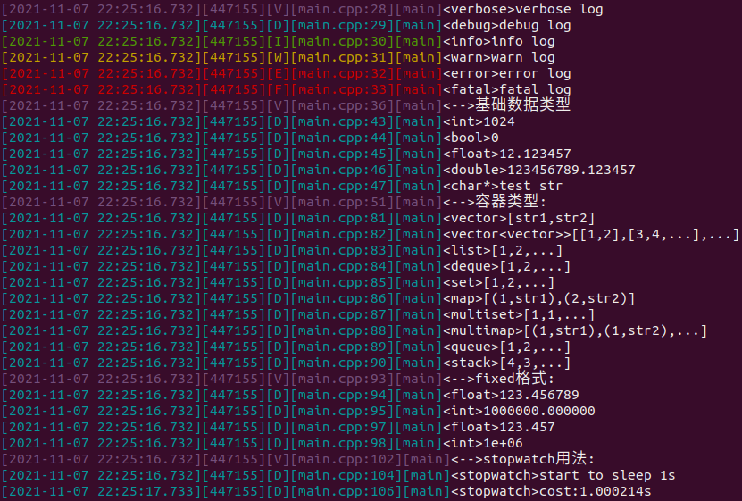

# meta_log

C++日志库

## 效果图



## 用法

```c++
// 终端打印日志
std::shared_ptr<meta_log::ConsoleLogger> console_logger =
        std::make_shared<meta_log::ConsoleLogger>("console_logger");
console_logger->SetHeaderPattern("[%Y-%M-%D %h:%m:%s.%i][%T][%v][%F:%L][%U]");
meta_log::AddLogger(console_logger);

// 截断文件日志
std::shared_ptr<meta_log::RotateFileLogger> rotate_file_logger =
    std::make_shared<meta_log::RotateFileLogger>("basic_file_logger", "./log", 1024 * 1024 * 10);
meta_log::AddLogger(rotate_file_logger);

// 设置日志等级
meta_log::SetLogLevel(meta_log::Level::VERBOSE);
// 设置浮点固定格式打印
meta_log::SetFlag(meta_log::Flag::FIXED);
// 设置容器打印最大元素数量
meta_log::SetContainerMax(2);
// 设置定时刷新日志
meta_log::FlushEvery(std::chrono::seconds(2));

// 基础使用
LOG_VERBOSE(verbose) << "verbose log";
LOG_DEBUG(debug) << "debug log";
LOG_INFO(info) << "info log";
LOG_WARN(warn) << "warn log";
LOG_ERROR(error) << "error log";
LOG_FATAL(fatal) << "fatal log";

// 容器(其他容器均支持打印)
std::vector<std::vector<int>> v{{1, 2}, {3, 4, 5}, {4, 5}, {6, 7}};
LOG_DEBUG(vector<vector>) << v;

// 记时
meta_log::StopWatch sw;
LOG_DEBUG(stopwatch) << "start to sleep 1s";
usleep(1 * 1e6);
LOG_DEBUG(stopwatch) << "cost:" << sw << "s";
sw.reset();
LOG_DEBUG(stopwatch) << "start to sleep 0.5s";
usleep(0.5 * 1e6);
LOG_DEBUG(stopwatch) << "cost:" << sw << "s";
```

## 日志格式

console和文件支持不同的日志头部格式，如果不显式设置格式，默认格式如下

```
[%Y-%M-%D %h:%m:%s.%i][%V][%T][%F:%L][%U]
[年-月-日 时:分:秒.毫秒][级别][线程][文件:行][函数]
```

格式

- %Y 年
- %M 月
- %D 日
- %h 小时
- %m 分钟
- %s 秒
- %i 毫秒
- %V 日志等级全称
- %v 日志等级缩写
- %T 线程号
- %F 文件名
- %L 行号
- %U 调用函数名
